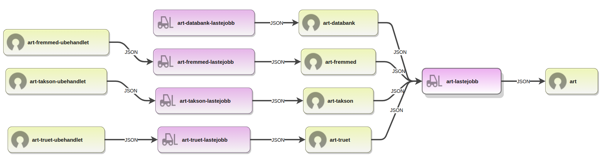

# Fremmede arter

Lastejobb for vurderinger av fremmede arter. Lastes fra [Fremmedarslista 2018](https://www.artsdatabanken.no/fremmedartslista2018).

## Dokumentasjon

- [Risikokategorier og kriterier
  ](https://www.artsdatabanken.no/Pages/239659/Risikokategorier_og_kriterier)

## Komponenter og dataflyt

### Dataflyt

### Tegnforklaring

| Symbol                                                                                                   | Forklaring               |
| -------------------------------------------------------------------------------------------------------- | ------------------------ |
|   | API (HTTP REST)          |
|  | Åpne data                |
|  | Kart                     |
|  | Lastejobb / Konvertering |
|   | Bibliotek                |
|  | Verktøy                  |
|   | Web-side/applikasjon     |
